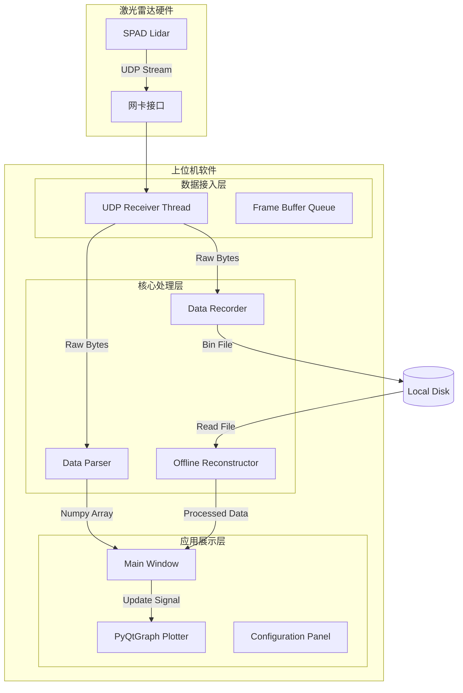
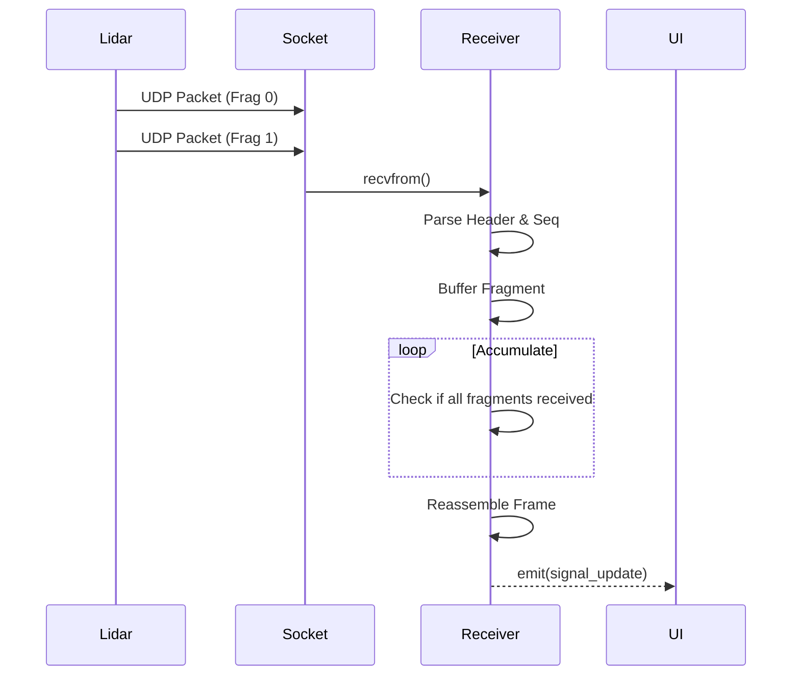
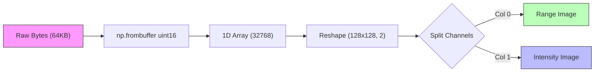
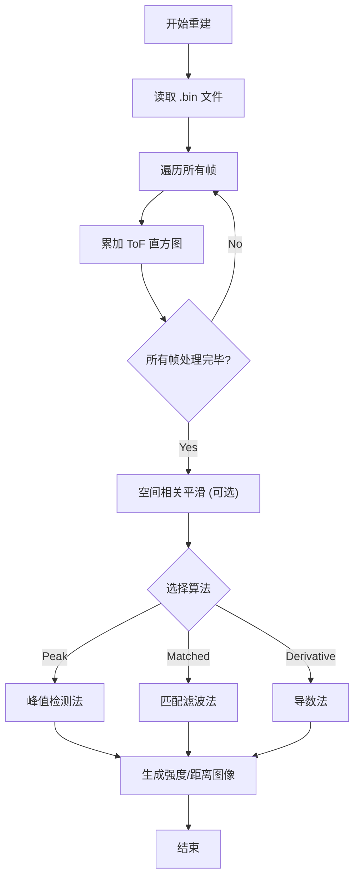
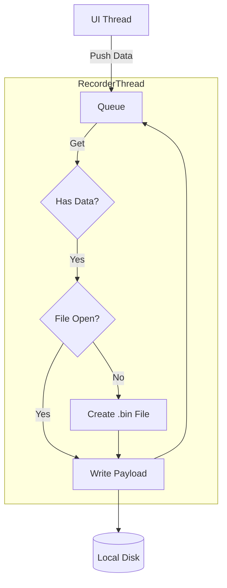
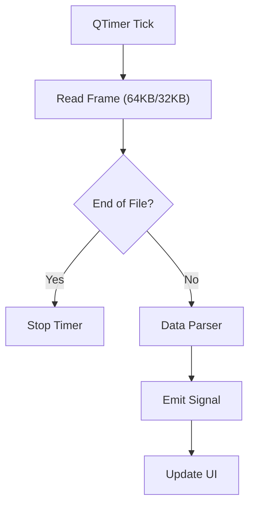

# 软件设计说明书 (Software Design Document)

**软件名称**：单光子激光雷达数据处理与可视化上位机软件
**版本号**：V3.0

---

## 1. 引言 (Introduction)

### 1.1 编写目的
本文档详细描述了“单光子激光雷达数据处理与可视化上位机软件”的系统架构、模块设计、数据流程及核心算法实现。主要面向软件开发人员、测试人员及系统维护人员，作为软件开发、测试验收及后期维护的技术依据。

### 1.2 背景
随着单光子探测技术的发展，对实时数据采集与处理的需求日益增长。本软件旨在为基于 UDP 协议传输的单光子激光雷达系统提供一套完整的数据接收、实时解析、可视化显示、数据存储及离线分析解决方案。

### 1.3 术语定义
- **SPAD**: Single-Photon Avalanche Diode (单光子雪崩二极管)。
- **ToF**: Time of Flight (飞行时间)。
- **UDP**: User Datagram Protocol (用户数据报协议)。
- **ROI**: Region of Interest (感兴趣区域)。
- **上位机**: 运行在通用计算机上的控制与显示软件。

---

## 2. 总体设计 (System Overview)

### 2.1 系统架构 (System Architecture)
本软件采用经典的分层架构设计，各层之间通过定义的接口进行通信，实现了高内聚低耦合的系统结构。

#### 架构图 (Mermaid Diagram)


### 2.2 运行环境
- **硬件环境**:
    - CPU: Intel Core i5 或以上 (推荐 i7 以支持高帧率实时处理)。
    - 内存: 8GB 或以上。
    - 网络: 千兆以太网接口。
    - 显卡: 支持 OpenGL 硬件加速 (推荐 NVIDIA GTX/RTX 系列)。
- **软件环境**:
    - 操作系统: Windows 10 / 11 (64位)。
    - 运行依赖: Python 3.8+, NumPy, PyQt5, PyQtGraph, OpenCV-Python。

### 2.3 模块划分
软件主要包含以下功能模块：
- **接收模块 (Receiver)**: 监听 UDP 端口，接收原始字节流，处理分包逻辑。
- **解析模块 (Parser)**: 解析协议头，提取强度、距离及 ToF 原始数据。
- **显示模块 (Visualization)**: 实时渲染强度图、距离图、ToF 深度图及直方图。
- **记录模块 (Recorder)**: 将原始 UDP 载荷数据保存为二进制文件 (.bin)。
- **回放模块 (Playback)**: 读取本地 .bin 文件，模拟实时数据流进行回放。
- **重建模块 (Reconstructor)**: 提供离线数据处理算法 (峰值法、匹配滤波、导数法) 及空间相关优化。

---

## 3. 详细设计 (Detailed Design)

### 3.1 接收模块 (Receiver Module)
**功能描述**：
接收模块 (`UdpReceiver`) 运行于独立子线程中，负责监听 UDP 端口数据，根据自定义协议进行分包重组，并将完整帧数据通过回调函数传递给上层。该模块设计了防阻塞机制和丢包检测逻辑。

**核心类设计**:
- **类名**: `UdpReceiver(threading.Thread)`
- **主要属性**:
    - `sock`: UDP 套接字对象。
    - `fragments`: 字典 `Dict[int, Dict[int, bytes]]`，用于缓存乱序到达的分片。Key为 TaskID，Value为序号到数据的映射。
    - `expected_fragments`: 字典，记录每个任务预期的分片总数 (Type 0: 16, Type 1: 8)。
- **主要方法**:
    - `run()`: 线程主循环，执行 `recvfrom(65536)`。
    - `_parse_ctrl(ctrl_bytes)`: 解析 2 字节控制字，提取分片信息。
    - `stop()`: 设置标志位并关闭套接字。

**数据流图 (Data Flow)**:


**核心逻辑**：
1.  **UDP 监听**: 创建 `socket.SOCK_DGRAM` 套接字，绑定本地 IP 和端口 (默认 5005)，设置接收缓冲区为 8MB 以防止丢包。
2.  **协议解析**:
    - 读取包头 (2字节)，校验是否为 `0xAA55` (或网络序 `0x55AA`)。
    - 读取控制字 (2字节)，解析分片标志 (Fragment Flag) 和分片长度。
    - 读取任务 ID (3字节)、类型 (1字节)、序号 (1字节)。
    - 数据对应的伺服状态：俯仰角度(2字节)和偏航角度(2字节)，类型为INT16，除以100得到原始角度信息。
    - 提取数据载荷 (Payload, 4096字节)。
3.  **分片重组 (Reassembly)**:
    - 维护 `fragments` 字典 `{task_id: {seq: payload}}`。
    - 根据类型 (`Type 0`: 强度/距离, `Type 1`: ToF) 确定预期分片总数 (16片或8片)。
    - 当收集到所有分片后，按序号拼接成完整帧。
4.  **数据分发**:
    - 若处于录制状态，将原始拼接数据写入文件。
    - 调用解析器进行数据解析，通过 PyQt 信号 (`sig_update_int_rng`, `sig_update_tof`) 发送给 UI 线程。

### 3.2 解析模块 (Parser Module)
**功能描述**：
解析模块 (`DataParser`) 为静态工具类，负责将原始字节流转换为 NumPy 数组。利用 NumPy 的 `frombuffer` 实现零拷贝（或低拷贝）的高效转换。

**数据结构**：
- **强度/距离帧 (65536 字节)**:
    - 格式: Interleaved (交错排列)，每像素 4 字节。
    - 结构: `[Range_Low, Range_High, Intensity_Low, Intensity_High]` (Little Endian)。
    - 算法:
        ```python
        data_u16 = np.frombuffer(raw_data, dtype=np.uint16)
        pixels = data_u16.reshape(-1, 2)
        range_raw = pixels[:, 0]      # 偶数位置
        intensity_raw = pixels[:, 1]  # 奇数位置
        ```

**数据处理流程图**:

- **ToF 帧 (32768 字节)**:
    - 格式: 每像素 2 字节 (uint16)。
    - 处理: 直接读取为 `(128, 128)` 的 uint16 数组，数值范围 0-16000。

### 3.3 离线重建模块 (Reconstruction Module)
**功能描述**：
重建模块 (`Reconstructor`) 继承自 `QThread`，用于处理离线保存的原始 ToF 数据文件 (.bin)。该模块实现了复杂的信号处理算法，通过直方图统计恢复强度像和距离像。

**算法流程图**:


**核心算法细节**：
1.  **直方图统计 (Histogram Accumulation)**:
    - 遍历所有帧，对每个像素点 (x, y) 统计其 ToF 值 (0-8000) 的出现频率，构建 3D 直方图 `H[128, 128, 8001]`。
    - 忽略首尾 50 个 ToF区间 (死区)。

2.  **空间相关 (Spatial Correlation)**:
    - **原理**: 利用相邻像素的相关性提高信噪比。
    - **实现**: 对 3D 直方图进行 3x3 空间域卷积 (Uniform Filter)，使每个像素的直方图融合周围 8 邻域的信息。
    - **公式**: $H'(x,y) = \sum_{i=-1}^{1}\sum_{j=-1}^{1} H(x+i, y+j)$

3.  **信号提取算法**:
    - **峰值法 (Peak Detection)**:
        - 直接查找直方图最大值 `max(H[x,y,:])` 作为强度。
        - 最大值对应的索引 `argmax(H[x,y,:])` 作为 ToF 值。
    - **匹配滤波 (Matched Filter)**:
        - 根据激光脉宽生成高斯核 (Gaussian Kernel) $G(t)$。
        - 在时间轴 (ToF Axis) 上对直方图进行一维卷积: $H_{smooth} = H * G$。
        - 对平滑后的直方图执行峰值检测。
    - **导数法 (Derivative Method)**:
        - 定义窗口大小 (Gate Step)，计算窗口积分差分 `Diff[k] = Gate[k] - Gate[k-2]`。
        - 查找最大上升沿位置，以此为基准计算加权平均 ToF。

### 3.4 存储与回放模块 (Recorder & Playback)
**功能描述**：
- **录制 (`Recorder`)**:
    - 采用生产者-消费者模型，`UdpReceiver` 将数据放入 `Queue`，`Recorder` 线程从队列取出写入磁盘。
    - 文件命名: `prefix_timestamp.bin` (如 `depth_20231027_120000.bin`)。
    - **技术点**: 仅存储 Payload，去除 UDP 协议头，确保数据纯净度，便于后续 MATLAB/Python 分析。
- **回放 (`Playback`)**:
    - **智能识别**: 通过文件名识别数据类型 (`depth` vs `tof`) 和帧大小。
    - **定时器驱动**: 使用 `QTimer` 定时读取下一帧数据，模拟 50Hz (20ms interval) 的数据流。
    - **循环机制**: 支持暂停、停止、拖动进度条跳转 (`seek`)。

**录制模块逻辑图**:


**回放模块逻辑图**:


---

## 4. 接口设计 (Interface Design)

### 4.1 外部接口 (UDP Protocol)
通信采用自定义 UDP 协议，网络序 (Big Endian) 或小端序自适应。

| 字节偏移 | 长度 | 说明 | 值/范围 |
| :--- | :--- | :--- | :--- |
| 0 | 2 | 帧头 (Header) | `0xAA55` |
| 2 | 2 | 控制字 (Control) | Bit15: 分片标志, Bit0-12: 分片长度 |
| 4 | 3 | 任务 ID (Task ID) | 帧唯一标识 |
| 7 | 1 | 数据类型 (Type) | `0x00`: Int/Rng, `0x01`: ToF |
| 8 | 1 | 分片序号 (Seq) | 0 ~ N-1 |
| 9 | 4096 | 数据载荷 (Payload) | 图像数据分片 |
| 4105 | 2 | 校验/尾部 (Tail) | `0x55AA` (可选) |

### 4.2 内部接口 (Signals)
组件间通过 Qt Signal/Slot 解耦：
- `sig_update_int_rng(np.ndarray, np.ndarray)`: 传递强度和距离图像。
- `sig_update_tof(np.ndarray)`: 传递 ToF 图像。
- `sig_log(str)`: 传递日志信息到 UI 状态栏。

---

## 5. 附录
### 5.1 图像坐标系
- 数据矩阵: `(Row, Col)` -> `(128, 128)`
- 显示坐标: `(x, y)` 对应 `(Col, Row)`，显示时需进行转置 (`.T`) 操作以匹配 PyQtGraph 的 `ImageItem` 坐标系 (x 轴向右, y 轴向下)。

