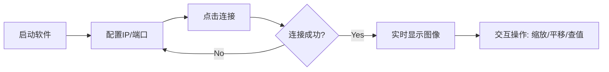

# 软件使用说明书 (User Manual)

**软件名称**：单光子激光雷达数据处理与可视化上位机软件
**版本号**：V3.0

---

## 1. 安装与配置 (Installation)

### 1.1 系统要求
- 操作系统: Windows 10 / 11 (64位)
- 处理器: Intel Core i5 或以上
- 内存: 8GB 或以上
- 显示器分辨率: 1920x1080 (推荐)

### 1.2 环境搭建
本软件基于 Python 运行，请按照以下步骤安装依赖：

1.  **安装 Python**: 下载并安装 Python 3.8 或更高版本。
2.  **安装依赖库**:
    打开命令行 (CMD) 或 PowerShell，并在项目根目录下执行：
    ```bash
    pip install -r requirements.txt
    ```
    *注：主要依赖包括 PyQt5, pyqtgraph, numpy, opencv-python, scipy 等。*

---

## 2. 快速入门 (Quick Start)

### 2.1 启动软件
在项目根目录下，双击运行 `main.py` 或在命令行中输入：
```bash
python main.py
```
启动后将显示软件主界面。

### 2.2 界面布局
软件界面主要分为两个区域：
- **左侧显示区**: 实时显示雷达图像数据。
    - **Tab 1**: 强度图 (Intensity) 和 距离图 (Range)。
    - **Tab 2**: 飞行时间图 (ToF)。
- **右侧控制区**: 用于配置参数、录制回放及离线分析。

---

## 3. 功能详细说明 (Detailed Features)

### 3.1 实时监控 (Real-time Monitoring)
本模块用于实时接收并可视化雷达数据流。

#### 操作流程图 (Operation Flow)


#### 详细操作步骤
1.  **网络配置**:
    - 在右侧“基础配置”页签中，输入本机网卡绑定的 IP (推荐 `0.0.0.0` 监听所有网卡，或指定 `127.0.0.1` 仅本地测试)。
    - 输入端口号 (默认 `5005`，需与雷达设备发送目标端口一致)。
    - 点击“连接”按钮，状态栏显示“已连接”。
2.  **图像交互**:
    - **缩放**: 鼠标滚轮前滚放大，后滚缩小。
    - **平移**: 按住鼠标左键拖动图像。
    - **复位**: 右键点击图像，选择 "View All" 恢复默认视图。
    - **数值探针**: 鼠标悬停在图像任意像素上，界面右下角状态栏会实时显示 `Pos: (x, y) Val: z`，方便定量分析。
3.  **显示控制**:
    - **Min/Max 阈值**: 调整直方图下方的 SpinBox，手动设置 Colorbar 的映射范围。例如，将 Max 设为 50，则所有大于 50 的值显示为最高亮色，突显弱信号细节。

### 3.2 数据录制 (Data Recording)
用于将实时接收的 UDP 数据保存为本地二进制文件。

#### 录制逻辑
- **纯净录制**: 仅保存图像 Payload 数据，去除网络头。
- **文件分割**: 每次点击“开始录制”生成一个新文件。
- **类型锁定**: 录制期间若雷达切换发送模式 (如从强度切到 ToF)，录制会自动停止或仅记录与首帧同类型的数据，防止文件损坏。

#### 操作步骤
1. 在右侧“数据录制”区域，点击“选择目录”设置保存路径 (默认当前目录)。
2. 点击“开始录制”按钮，按钮变红，状态栏显示当前写入字节数。
3. 文件名自动生成格式: `depth_YYYYMMDD_HHMMSS.bin` (强度/距离) 或 `tof_...` (ToF)。
4. 点击“停止录制”结束保存。

### 3.3 数据回放 (Playback)
模拟雷达数据流，重现历史数据。

#### 步骤
1. 切换到“数据回放”区域。
2. 点击“加载文件”选择 `.bin` 文件。
    - **注意**: 文件名必须包含 `depth_` 或 `tof_` 前缀，否则软件可能无法正确解析帧结构。
3. 点击“播放”按钮，软件将以 50Hz (20ms/帧) 的速率推送数据。
4. **进度控制**: 拖动下方滑块可快速跳转到任意帧；点击“暂停”可定格画面进行详细分析。

### 3.4 离线重建 (Offline Reconstruction)
核心高级功能，用于从海量光子数据中提取高精度深度信息。

#### 算法参数详解
- **算法选择**:
    - **Peak (峰值法)**: 计算最快，直接取直方图最大值。适用于强信号、低噪声环境。
    - **Matched (匹配滤波)**: *推荐*。利用激光脉冲模型 (Gaussian) 平滑直方图，显著提升信噪比。
        - **Pulse Width**: 激光脉宽参数 (默认 10ns)，值越大平滑力度越强，但可能降低距离分辨率。
    - **Derivative (导数法)**: 寻找回波信号的上升沿。适用于存在长拖尾效应的 SPAD 探测器。
        - **Gate Step**: 积分窗口大小 (默认 8 bin)。
        - **Threshold**: 上升沿检测阈值。
- **Spatial Corr (空间相关)**:
    - 勾选后，在重建前对 3x3 邻域像素直方图进行叠加。
    - **效果**: 牺牲微小的空间分辨率，换取大幅度的测距稳定性提升，特别适合远距离弱信号场景。
- **Max Frames**:
    - 设置读取文件的最大帧数 (0 表示全部)。对于 >2GB 的超大文件，建议设置此值 (如 1000 帧) 以免内存溢出。

#### 执行步骤
1. 加载 ToF `.bin` 文件。
2. 配置上述算法参数。
3. 点击“开始重建”。
4. 进度条走完后，软件自动弹出“全局 ToF 直方图”窗口，显示所有像素的时间分布统计，辅助判断激光峰值位置。
5. 主界面左侧 Tab 1 自动切换显示重建后的强度图和距离图。

---

## 4. 常见问题 (FAQ)

**Q: 图像显示全黑或无数据？**
A: 请检查防火墙是否拦截了 UDP 端口 (5005)，或确认雷达设备 IP 配置是否正确。

**Q: 离线重建速度慢？**
A: 重建过程涉及大量直方图统计运算，处理大文件 (如 >1GB) 耗时较长属正常现象。建议开启多线程或减少处理帧数。

**Q: 报错 "MemoryError"？**
A: 离线重建需要构建完整的 3D 直方图 (128x128x8000 uint16)，约占用 260MB 内存。若同时处理多组数据或文件过大，可能导致内存不足，请确保系统可用内存充足。
